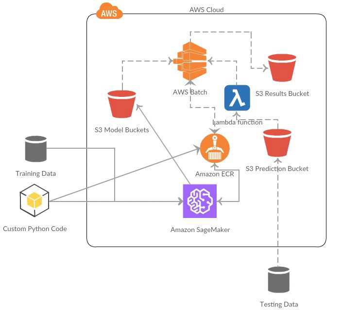

# Text Classification with Gluon on Amazon SageMaker and AWS Batch



Source: [aws-ml-blog](https://aws.amazon.com/blogs/machine-learning/text-classification-with-gluon-on-amazon-sagemaker-and-aws-batch/)

> Note: Currently the demo is in region: us-west-2

This is a revised version of Amazon SageMaker blog code.
 
# FAQs
* ***fail to build wheel for scipy***
    
    Add ```RUN apt-get update``` and ```RUN apt-get install -y python-dev``` on top of [Dockerfile](./container/Dockerfile) 
    
* ***MXNetError: [06:11:12] src/operator/tensor/./broadcast_reduce_op.h:141: Check failed: axis < ndim && axis >= -ndim axis 1 exceeds the input dimension of 1***

    Add `keepdims=True` in `mx.nd.argmax` functions.
    
    Ref:
    
    *https://github.com/apache/incubator-mxnet/issues/6405*
    
    *https://mxnet.incubator.apache.org/api/python/model.html?highlight=metric#mxnet.metric.Accuracy*
    
    *https://mxnet.incubator.apache.org/api/python/ndarray/ndarray.html?highlight=argmax#mxnet.ndarray.argmax*
    
# TODOs
- [ ] add support for py3
- [ ] fix Batch source command hard coded filename in [create.yaml](./cloudformation-templates/create.yaml)
- [X] change path for `AmazonSageMakerExecutionRole` in `create.yaml`
- [X] add batch access and lambda access for SageMaker execution role
- [X] change to aws-cli default region in [lambda_function.py](./lambda-function/lambda_function.py)